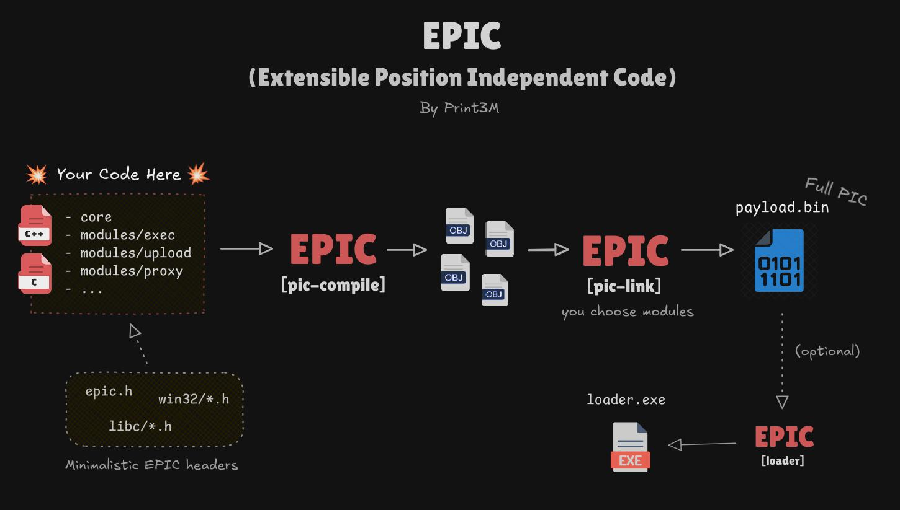

# EPIC

EPIC (*Extensible Position Independent Code*) – PIC shellcode development and building framework designed for developer experience, predictability, and modularity. *Write code, EPIC will take care of the rest!*



EPIC is a robust single-executable toolkit for the complete PIC shellcode development workflow – offering quick project initialization, compilation, and payload linking with a rich set of built‑in features. It makes building stealth modular implants effortless.

- Built-in modularity – you choose what you want to include!
- Built-in global context support – no memory permission changes.
- Built-in dead-code elimination – smallest payload on the market.
- Predictable PIC compilation – no implicit syscalls, no unexpected code, no dependencies.
- Built-in minimal `libc` and `win32` written for PIC compatibility.
- Built-in C and C++ (and mixing) support.
- More...

## Quick Start

Download compiled EPIC binary from [release page](https://github.com/Print3M/epic/releases).

Requirements:

- Windows, Linux, or MacOS
- Latest MinGW-w64 tool-chain (`gcc`, `ld`, `objcopy`)

```bash
# 1. Create initial project structure
mkdir project/
epic init project/

# 2. Write your code!

# 3. Compile PIC code
mkdir output/
epic pic-compile project/ -o output/ -m hello

# 4. Link PIC code into standalone payload.bin
epic pic-link output/ -o output/ -m hello
```

That's it! At this point, you can take the generated `payload.bin` and inject it into your custom shellcode loader, or...

```bash
# 5. [Optional] Inject PIC payload and compile a simple loader template
epic loader payload.bin -o output/
```

The compiled `loader.exe` is ready to execute. If your payload works here, it will work everywhere.

---

## EPIC Commands

### `init <path>`

Example: `epic init project/`

Creates a project structure to start a new PIC project with basic usage example. The `<path>` parameter specifies where the project structure will be created.

> **HINT**: This command creates a directory structure, so set `<path>` to a separate directory to keep things organized.

### `pic-compile <path>`

Example: `epic pic-compile project/ -o objects/`

Compiles all source files from the project at `<path>` and saves object files to the output directory. The output structure directly mirrors the project structure. This command compiles all modules.

> **HINT**: Save object files to a separate folder (e.g., `output/`) to maintain a clean workspace.

Flags:

- `-o / --output <path>` [required] – Output path for compiled object files.
- `--gcc <string>` – Specify additional flags for GCC compilation (e.g. `--gcc '-DDEBUG'`)
- `--strict` – Enable all compiler checks (`-Wall`, `-Wextra`, `-pedantic`).

### `pic-link <path>`

Example: `epic pic-link objects/ -o output/`

Links core and selected modules from `<path>` into a standalone PIC payload. The `<path>` parameter should point to the output directory from `pic-compile`. Only modules specified with the `-m` flag are linked.

> **HINT**: An `assets/` folder is created in the output path containing the linker map, linker script, and intermediate executable for debugging purposes.

Flags:

- `-o / --output <path>` [required] – Output path for the payload.
- `-m / --modules <modules>` – Comma-separated list of modules to link (named after their folders in `modules/`).

### `loader <path>`

Example: `epic loader output/payload.bin -o output/`

Injects your payload from `<path>` into a loader template and compiles it to a Windows executable. This is an excellent way to quickly test and debug your payload. If your PIC payload works with the loader template, it should work with your custom loader as well.

> **HINT**: An `assets/` folder is created in the output path containing the `loader.c` source file that gets compiled, allowing you to inspect the implementation.

Flags:

- `-o / --output <path>` [required] – Output path for the loader executable.

### `monolith <path>`

Example: `epic monolith project/ -o output/`

Compiles your project into a standard non-PIC executable (called a "monolith" in EPIC). This is a completely separate process from pic-compile and pic-link. Since it's a standard executable, you can use standard libc functions like `printf()` for debugging. Monoliths are useful for debugging and verifying payload functionality when screen output is unavailable. This command compiles all modules at once.

Flags:

- `-o / --output <path>` [required] - Output path for the monolith executable.

### Global flags

The following optional flags can be used with any command:

- `--debug` – Enable verbose debug mode.
- `--mingw-w64-gcc <path>` – Specify path to MinGW-w64 GCC.
- `--mingw-w64-ld <path>` – Specify path to MinGW-w64 ld.
- `--mingw-w64-objcopy <path>` – Specify path to MinGW-w64 objcopy.
- `--no-banner` - Disable EPIC banner.
- `--no-color` - Disable colored output.

---

## EPIC Coding Guide

### Where to start?

Use `epic init <path>` to create a proper EPIC project structure with all features, header files, and entry point.

Project structure:

```text
core/main.cpp    <-- Entry point to your code
include/
    libc/*       <-- libc headers (PIC-compatbile)
    win32/*      <-- WinAPI headers (PIC-compatible)
    epic.h       <-- EPIC macros
modules/
    <your_module_1>/*
    <your_module_2>/*
    ...
```

Your shellcode entry point is in `core/main.cpp`. The `main_pic()` function is where you begin writing your code. The `core/` directory has special significance because it is always linked to every payload, unlike `modules/`, which you have control over.

```c
// EPIC: Entry point
SECOND_STAGE void main_pic() {
    // Your code here!
}
```

> **IMPORTANT #1**: Never implement a function named `main()`! This will cause strange errors. See the FAQ section for a detailed explanation.

> **IMPORTANT #2**: Do not remove the `__main_pic()` and `WinMain` functions. They are essential for proper compilation.

### Global variables

In PIC code, you cannot use global read-write variables:

```c
// WRONG: Global read-write variables are fobidden!
int counter = 5;

void inc_counter() {
    counter += 1;
}
```

You can only use global constants and constant literals:

```c
// OK: This constant is allowed
const char *name = "EPIC";

void calc() {
    // OK: This constant is also allowed
    exec("calc.exe");
}
```

However, global variables are useful and can significantly simplify code. Fortunately, EPIC has a solution!

```c
typedef struct {
    const char *name;
} GlobalCtx;

void child_func() {
    GlobalCtx* ctx = (GlobalCtx *) GET_GLOBAL(); // Access global context

    exec(ctx->name);
}

SECOND_STAGE void main_pic() {
    GlobalCtx* ctx = (GlobalCtx *) GET_GLOBAL(); // Access global context
    
    ctx.name = "calc.exe";

    child_func();
}
```

What sorcery is this?! It's a simple compiler trick. EPIC uses a fixed CPU register (`RBX`) to store a pointer to a local variable via `SAVE_GLOBAL(ctx)` in `__main_pic()`. Because it's called by `__main_pic()` the local variable becomes effectively global context for the entire shellcode. You can access it using the `GET_GLOBAL()` macro from anywhere in your shellcode. Adjust the `GlobalContext` structure however you like.

> **NOTE**: If your shellcode uses code that is not compiled by EPIC, there might be a problem. In the calling convention used on Windows, the RBX register is preserved, i.e., it is not changed by the called functions. But if you use some other code that overwrites and does not restore the RBX register state, you will lose the pointer to your global structure. Also writing inline assembly you should be careful not to overwrite the RBX register.

### Modularity

Modularity is a core feature of EPIC. Compile your code once with `pic-compile`, then mix modules during linking with `pic-link` however you want. But how does the same code work with different modules?

First, mark all exported functions from a module with the `MODULE` macro. Mark all of them without exception to avoid future debugging headaches. For example, `modules/exec/exec.h` would look like this:

```c
#include <epic.h>

MODULE int happy_little_function(char *arg);
```

That's it. Now elsewhere in your code, you can check whether a module (specifically a function) is loaded using `EXISTS(func)` macro:

```c
#include <epic.h>
#include <modules/exec/exec.h>

void test() {
    if (EXISTS(happy_litle_function)) {
        // Module is linked and function is available!
    }
}
```

This is a powerful yet simple mechanism that makes your PIC project fully modular.

> **IMPORTANT**: Functions exported from a module MUST be marked with the `MODULE` tag, otherwise you'll encounter strange errors and the `EXISTS(func)` macro won't work.

Each module must reside in a separate directory within `modules/`. Directory names serve as module names for the `pic-link` command's `-m` parameter (e.g., `-m exec`). Note that with modular code, you only need to compile once with `pic-compile`, then repeatedly use `pic-link` with different module combinations!

### Header files (`libc` and `win32`)

You cannot use the standard `libc` library. You don't have access to normal functions like `printf()` or `malloc()` – you must locate everything in memory yourself. Why? This is the basic principle of writing shellcode. I explain this in detail [in this article](https://print3m.github.io/blog/x64-winapi-shellcoding).

You cannot use default MinGW header files. Why? Long story short, they contain massive bloat that adds code fragments causing far more problems than benefits in PIC code. See the FAQ for more details.

Fortunately, EPIC provides a minimalist PIC-compatible `libc` implementation and basic `win32` headers. These are located in your project's `include/*` directory. They're convenient and completely safe for PIC code. You can modify them in your project as needed, or not use them at all.

All EPIC macros are in `include/epic.h`.

Import example:

```c
#include <libc/stdint.h>
#include <win32/windows.h>
#include <epic.h>
```

### Preprocessor Symbols

When using the `monolith` command, the compiler automatically defines the `MONOLITH` preprocessor symbol. Use it to write code specifically for monolith compilation:

```c
#ifdef MONOLITH
#include <stdio.h>
#endif

void func() {
    #ifdef MONOLITH
    printf("This is printed only when compiled as monolith!");
    #endif
}
```

When using `pic-compile`, the compiler defines the `PIC` preprocessor symbol. This is less common but useful for excluding code from monolith compilation.

### Mixing C and C++

You can use C, C++, or both in the same project. When calling C++ functions from C, remember to use `extern "C"` in the C++ function header to avoid name mangling and linking errors. I generally recommend sticking to one language for the entire project, but you're a free human being.

### Other shellcode quirks

You cannot use:

- global read-write variables,
- standard libc or libc++ functions,
- C++ exceptions (`throw`/`try`/`catch`),
- C++ `typeid` mechanism,
- C++ `new`/`delete` operators.

You can use (if you had any doubts):

- switch statements,
- global constants and literals (both: `"test"` and `L"test`),
- inline assembly,
- C++ namespaces,
- C++ templates.

---

## FAQ

### Troubleshooting

1. Rebuild from scratch – Clean your object files directory and run `pic-compile` + `pic-link` again
2. Test with `monolith` – Compile a monolith version with debugging code to verify basic functionality.
3. Review your code – Ensure you're following all EPIC Coding Guide rules.
4. Inspect the linker map – Check the linker map in `assets/` after running `pic-link` to verify which functions are included in the final payload.
5. Enable debug output – Run with the `--debug` flag to see detailed compilation and linking information.

If nothing helps, you are cooked.

### EPIC Limitations

- Supported target OS: Windows
- Supported architecture: x86-64
- Supported languages: C and C++

### Module function doesn't execute

Check the linker map file in `assets/` (generated after running `pic-link`) to verify the function is linked into the final PIC payload. If it's linked but still not executing, the issue is most likely in your code (96.5% probability). This typically indicates dead code elimination occurred. Verify you're not calling C++ functions from C code without using `extern "C"`.

### Do I need to use `inline` functions in shellcode?

No. Use functions normally as you would in regular code. Just remember to mark functions exported from modules with the `MODULE` macro.

### What is `monolith`?

Monolith is simply a compilation of your entire project as standard non-PIC code. It's a normal `.exe` file that can use the standard library, global variables, and all typical language features. The purpose of monolith is debugging – it allows you to test your payload logic with standard debugging tools like `printf()`.

### Why are global variables not usable in PIC payload?

Global variables require read-write (RW) memory sections to function. The essence of shellcode is that you only need to allocate executable (RX) memory and run it – no special RW sections required.

There are workarounds, such as the technique used in the Stardust project, where shellcode modifies its own `.bss` and `.data` section permissions at runtime to enable global variables. However, this approach has drawbacks I wanted to avoid:

1. It requires additional code.
2. The shellcode must call Windows API functions to change memory page permissions, providing extra information to the kernel.
3. The shellcode must be a little bit larger to ensure `.bss` and `.data` sections start on new memory pages.

This is why I created the CPU register-based global variable mechanism instead.

### Why are `pic-compile` and `pic-link` separate commands?

This separation enables you to compile once but link multiple times with different module combinations, creating a new shellcode each time without recompiling.

### Why is PIC extracted from a PE file?

You can use the "binary" format as the linker output, but then dead code elimination doesn't work.

To work around this, I use the MinGW-w64 toolchain (`gcc`) with a custom linker script (`ld`) to produce a PE file, then extract the PIC `.text` section using `objcopy` to create the final `payload.bin`. This approach works excellently and produces the smallest possible payload.

### Do I have to manually align the stack before calling Windows API?

No, MinGW handles stack alignment automatically. However, you must mark every Windows API function with the `WINAPI` macro.

### Why is the entry point called `__main_pic` and not simply `main()`?

When implementing a `main()` function, GCC always treats it specially regardless of compiler flags, function attributes, or linker script configurations. It invariably generates an unnecessary call to `__main()` at the beginning of `main()`, requiring you to implement a dummy `__main()` function to avoid linker errors. The reason for this behavior is unknown and I found no way to disable it.

One solution is using `main()` as the entry point and implementing an empty `__main() {}` function. While this works, I wanted the code to be as clean as possible without dummy functions.

The better solution is avoiding `main()` entirely. I created the `__main_pic()` function as the entry point instead, and it works flawlessly.

### Why does EPIC implement its own `libc` and `win32` headers instead of using MinGW's?

Obviously, shellcode cannot have external dependencies, but theoretically EPIC could use type definitions and macros from default MinGW headers, right? Wrong. Default header files are bloated and add code without your knowledge, causing compilation errors even when you only use type definitions and macros. They also encourage using functions that are unavailable in shellcode, like `printf()`.

Simply including default Windows MinGW-w64 headers throws compilation errors with EPIC compiler flags. For example, they require SSE to be enabled, which I want disabled. This is why EPIC provides custom headers instead of using default ones – to have full control over your code.

### Can I check exactly which functions are linked to the PIC payload?

Yes. EPIC automatically generates a linker map after running `pic-link`, saved in the `assets/` directory.

This map shows which sections (when using `-ffunction-sections`, each section represents a function) are discarded and which are linked into the final payload. It displays the layout of linked sections and their sizes – an excellent debugging tool for deep inspection of the linker's work.

### Can I manually disassemble the PIC payload?

Yes. Use the following command:

```bash
objdump -D -b binary -m i386:x86-64 -M intel payload.bin -z
```

## Credits

- [Stardust by 5pider](https://github.com/Cracked5pider/Stardust) for inspiration.
- [PIClin by JJK96](https://github.com/JJK96/PIClin) for inspiration.
- [c-to-shellcode.py](https://github.com/Print3M/c-to-shellcode) – EPIC is basically a follow-up to my previous PoC.
